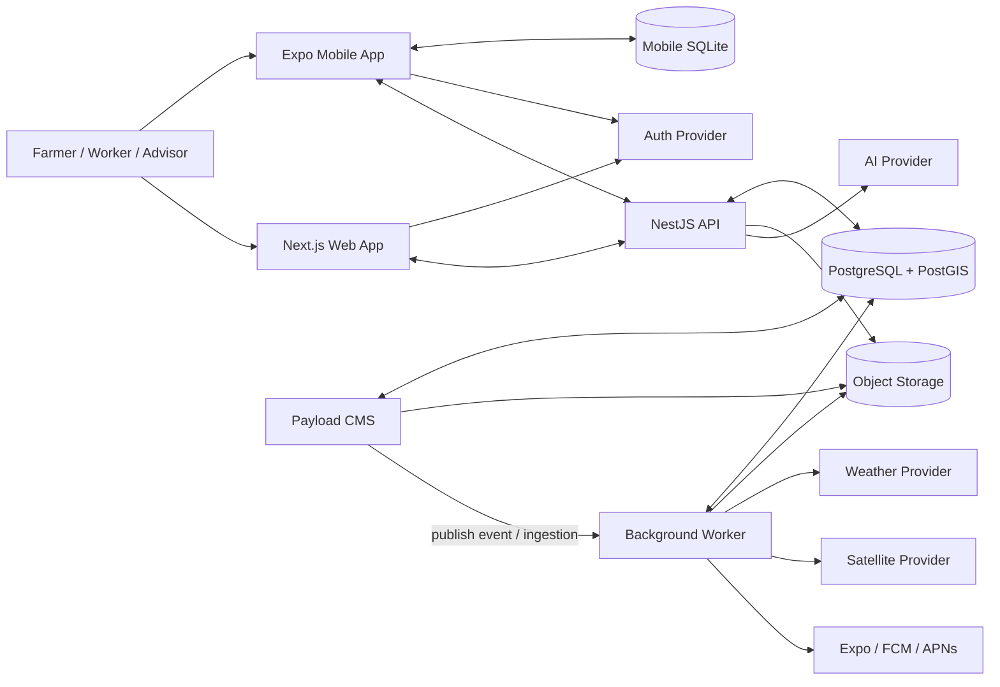
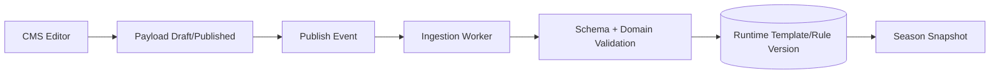
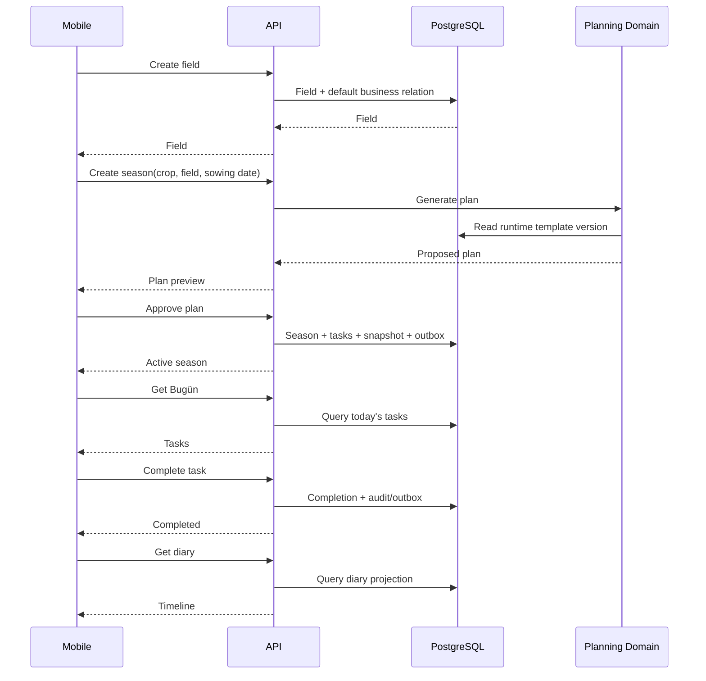

# Ekim Hasat — ARCHITECTURE.md

**Status:** Recommended technical baseline  
**Input:** `Ekim_Hasat_PRD.md`  
**Audience:** Engineering, Codex, spec-kit, Superpowers, Graft-enabled development workflow  
**Architecture style:** TypeScript modular monolith + asynchronous workers + offline-first mobile client  
**Primary goal:** Preserve the PRD's farmer simplicity while keeping the system technically capable of weather, GIS, satellite, offline sync, multi-business permissions, auditability, and future AI.

---

# 1. Architecture Decision Summary

The recommended target architecture is:

| Layer | Decision |
|---|---|
| Repository | TypeScript monorepo |
| Package manager | pnpm |
| Monorepo orchestration | Turborepo |
| Web | Next.js App Router |
| Mobile | Expo / React Native |
| API | NestJS using Fastify adapter |
| Runtime architecture | Modular monolith |
| Async processing | Separate worker process sharing domain packages |
| Primary database | PostgreSQL |
| Geospatial | PostGIS |
| App ORM | Prisma with PostGIS support |
| CMS | Payload CMS |
| Mobile offline DB | SQLite |
| API contract | Versioned REST + OpenAPI |
| API client | Generated typed TypeScript client |
| Authentication | External identity provider behind an auth adapter; recommended initial provider: Supabase Auth |
| Object storage | S3-compatible storage behind a storage adapter |
| Background jobs | PostgreSQL-backed queue; recommended initial implementation: pg-boss |
| Push notifications | Expo Notifications → FCM/APNs |
| Weather | Provider adapter; initial provider may be Open-Meteo |
| Satellite | Provider adapter; asynchronous processing |
| Maps | Provider-neutral map component/adapters |
| Observability | Structured logs + Sentry + OpenTelemetry |
| CI | GitHub Actions |
| Testing | Unit + integration + contract + web E2E + mobile E2E |
| Agent workflow | PRD → Architecture → spec-kit specification → plan → tasks → Superpowers/TDD execution → review |
| Graft | Development-time context/memory/index layer only; never a runtime product dependency |

The application **must not begin as microservices**.

The initial system should be a well-structured modular monolith that can later extract services only when operational evidence justifies it.

---

# 2. Architectural Drivers from the PRD

The architecture is shaped by the following non-negotiable product requirements.

## 2.1 Mobile must be sufficient

A farmer cannot be required to use the web application.

Therefore:

- all essential domain APIs must be usable from mobile;
- business logic must not live only inside Next.js server actions;
- mobile and web must use the same domain/API behavior.

---

## 2.2 Offline is a first-class capability

The mobile application must continue basic field work without connectivity.

Therefore:

- the mobile client requires a real local database;
- offline writes must be queued rather than discarded;
- synchronization requires explicit versioning/idempotency;
- photos and attachments require deferred upload handling;
- conflict behavior must be designed per entity type.

---

## 2.3 Strong business isolation

A user may belong to several businesses with different roles.

Therefore:

- every business-owned record must carry a business boundary;
- the API must derive permissions from authenticated membership;
- the client must never be trusted to self-authorize access by merely sending a `businessId`.

---

## 2.4 Historical integrity

A completed operation, cost, harvest, sale, or observation cannot behave like an ordinary editable note.

Therefore:

- operational facts need auditability;
- deletion semantics differ by record type;
- season context and content versions must be snapshotted.

---

## 2.5 Weather/risk may affect plans but must not silently control them

Therefore:

- plan changes are modeled as proposals/decisions;
- precedence is deterministic;
- a single rule engine evaluates task-changing signals;
- the default action is approval, not invisible modification.

---

## 2.6 CMS must not be a runtime single point of failure

Therefore:

- active seasons cannot query Payload on every request;
- published agricultural content must be converted into immutable runtime snapshots;
- active season behavior must continue when CMS is unavailable.

---

## 2.7 Geospatial data is a real domain concern

Fields may be points or polygons.

Satellite features require verified polygons.

Therefore:

- PostgreSQL + PostGIS is the canonical geospatial store;
- geometry must not be stored only as arbitrary JSON;
- boundary versions must be retained historically.

---

## 2.8 AI is optional

Therefore:

- business logic cannot depend on an LLM;
- AI must call controlled application tools/commands;
- failure of the AI provider must not break manual workflows.

---

# 3. Architecture Style

## 3.1 Modular Monolith

Use one API deployable, one worker deployable, and clearly separated domain modules.

This gives:

- one transactional database,
- easier debugging,
- fewer distributed-system failure modes,
- simpler Codex implementation,
- easier offline synchronization,
- easier schema evolution,
- straightforward testing.

A module is a logical boundary, not a network boundary.

Possible future extraction is allowed, but no module should be split into a service merely because it has a separate name.

---

## 3.2 Processes

The initial runtime consists of five major deployable applications:

1. **Web**
2. **Mobile**
3. **API**
4. **Worker**
5. **CMS**

And three major managed infrastructure dependencies:

1. PostgreSQL/PostGIS
2. Object storage
3. Authentication provider

---

# 4. High-Level Architecture



---

# 5. Core Architectural Rule

**The API is the authoritative business boundary.**

Neither the mobile app nor the web app should implement authoritative domain rules independently.

Clients may implement:

- UI state,
- optimistic state,
- local validation,
- local offline projections.

The server owns:

- authorization,
- business isolation,
- season plan generation,
- rule precedence,
- audit behavior,
- risk derivation,
- finance calculations,
- content version binding,
- conflict resolution decisions.

---

# 6. Recommended Repository Layout

```text
ekim-hasat/
├─ apps/
│  ├─ web/
│  ├─ mobile/
│  ├─ api/
│  ├─ worker/
│  └─ cms/
│
├─ packages/
│  ├─ domain/
│  ├─ contracts/
│  ├─ database/
│  ├─ auth/
│  ├─ geo/
│  ├─ rule-engine/
│  ├─ sync/
│  ├─ notifications/
│  ├─ storage/
│  ├─ observability/
│  ├─ ui-web/
│  ├─ ui-mobile/
│  ├─ config/
│  └─ test-utils/
│
├─ docs/
│  ├─ PRD.md
│  ├─ ARCHITECTURE.md
│  ├─ ADR/
│  └─ diagrams/
│
├─ specs/
│  └─ ... generated/maintained by the selected spec-kit workflow
│
├─ .specify/
│  └─ ...
│
├─ AGENTS.md
├─ package.json
├─ pnpm-workspace.yaml
└─ turbo.json
```

Exact spec-kit folders should follow the installed spec-kit distribution rather than being manually invented.

---

# 7. Application Responsibilities

## 7.1 `apps/web`

Responsibilities:

- desktop/web user experience,
- planning,
- multi-field review,
- reports,
- bulk-friendly screens,
- business/team administration,
- optional web version of daily operations.

Must not:

- contain authoritative business rules that mobile cannot use;
- directly mutate the application database.

Web writes go through the API.

---

## 7.2 `apps/mobile`

Responsibilities:

- daily farmer workflow,
- Bugün,
- tasks,
- observations,
- photos,
- quick records,
- offline operation,
- background/deferred sync,
- push notification handling.

The mobile app owns its SQLite cache, but the server remains canonical after synchronization.

---

## 7.3 `apps/api`

Responsibilities:

- authentication verification,
- authorization,
- domain commands,
- domain queries,
- validation,
- transaction boundaries,
- REST API,
- OpenAPI publication,
- sync endpoints,
- AI tool gateway,
- signed-upload coordination,
- audit generation.

---

## 7.4 `apps/worker`

Responsibilities:

- scheduled weather refresh,
- satellite processing,
- risk recalculation,
- daily notification digest,
- push delivery,
- report generation,
- file post-processing,
- CMS publication ingestion,
- asynchronous event handlers.

The worker imports the same domain packages used by the API.

It must not maintain a separate copy of business logic.

---

## 7.5 `apps/cms`

Responsibilities:

- central crop content,
- varieties,
- stages,
- templates,
- regional rules,
- weather/risk rule configuration,
- agricultural guides,
- publication/versioning workflow.

Payload is a **content-authoring system**, not the runtime source for every farmer request.

---

# 8. Domain Modules

The modular monolith should use the following bounded modules.

## 8.1 Identity & Membership

Owns:

- application user profile,
- businesses,
- memberships,
- role/scope,
- invitations,
- advisor access,
- access revocation.

Does not own external credentials/passwords.

---

## 8.2 Fields & Geography

Owns:

- fields,
- field sections,
- point location,
- boundary versions,
- administrative region,
- agricultural region,
- geometry verification state.

---

## 8.3 Crop Catalog

Owns runtime crop/catalog snapshots required by farmer workflows.

Authoring occurs in CMS.

---

## 8.4 Seasons

Owns:

- season lifecycle,
- crop assignment,
- planting/sowing dates,
- seasonal context snapshot,
- growth stage state,
- season status.

---

## 8.5 Planning

Owns:

- plan generation,
- template resolution,
- previous-plan reuse,
- personal adaptation proposals,
- task generation.

---

## 8.6 Tasks

Owns:

- task lifecycle,
- assignment,
- recurrence,
- policy type,
- planned date,
- actual completion,
- overdue state,
- optional approval.

---

## 8.7 Decision Engine

Owns task-change evaluation.

Inputs may include:

- manual decisions,
- safety/fixed deadline rules,
- current stage,
- weather,
- confirmed risk,
- central template,
- personal preferences.

Outputs are explicit change proposals or safe automatic changes according to policy.

---

## 8.8 Weather

Owns:

- provider integration,
- weather snapshot normalization,
- freshness,
- field/region forecast association,
- weather-derived signals.

---

## 8.9 Observations & Diary

Owns:

- field observations,
- notes,
- photos,
- chronological diary projection.

---

## 8.10 Field Health & Risk

Owns:

- normalized risk evidence,
- weather risks,
- observation inputs,
- limited satellite inputs,
- risk assessments,
- field-check requests,
- risk resolution.

---

## 8.11 Satellite

Owns:

- provider requests,
- polygon eligibility,
- source metadata,
- quality/cloud status,
- normalized derived measurements.

Satellite processing must remain asynchronous.

---

## 8.12 Operations

Owns domain records such as:

- irrigation,
- input applications,
- equipment references.

---

## 8.13 Finance

Owns:

- expenses,
- cost categories,
- basic season profitability.

This module explicitly does not become accounting software.

---

## 8.14 Harvest & Sales

Owns:

- harvest records,
- sales,
- post-harvest disposition quantities.

---

## 8.15 Notifications

Owns:

- notification intents,
- priority,
- deduplication,
- digest composition,
- delivery status,
- user notification preferences.

---

## 8.16 Reports & Export

Owns:

- standard report queries,
- asynchronous PDF/export jobs,
- user data exports.

---

## 8.17 Sync

Owns:

- device registration,
- sync cursors,
- mutation idempotency,
- change feed,
- conflict metadata,
- offline authorization lease.

---

## 8.18 Audit

Owns immutable history for relevant mutations.

---

# 9. Database Architecture

## 9.1 Canonical Store

Use PostgreSQL as the canonical application database.

Enable PostGIS for geospatial fields.

---

## 9.2 Schema Ownership

Migration ownership must be explicit.

Recommended separation:

```text
app domain        → Prisma migrations
CMS data          → Payload migrations
auth provider     → provider-owned auth schema/tables
PostGIS extension → infrastructure migration
```

Two migration systems must never manage the same tables.

CMS may use:

- a separate database, or
- a separate PostgreSQL schema,

provided Payload remains the sole migration owner of its tables.

---

## 9.3 IDs

Use client-generatable sortable UUIDs, preferably UUIDv7.

Reasons:

- offline mobile creation,
- collision-resistant IDs,
- no server round trip to allocate identity,
- reasonable index locality.

Every client-created offline-capable record receives its final ID at creation time.

---

## 9.4 Time

Store server timestamps in UTC.

For farmer planning, distinguish:

- `planned_local_date`
- optional local time
- business/field timezone
- UTC event timestamp

A task planned for “Friday” should not accidentally move days because of UTC conversion.

---

## 9.5 Units

Do not store only display strings.

Recommended approach:

- canonical numeric value,
- unit code,
- optional original entered unit where useful.

Examples:

- area canonical: square meter
- display: decare/hectare
- weight canonical: kilogram
- currency: decimal amount + ISO currency code

Avoid binary floating point for money.

---

# 10. Core Data Model

This is conceptual. Exact columns belong in feature specs and migrations.

```text
UserProfile
Business
Membership
Invitation
Device
OfflineAccessLease

Field
FieldSection
FieldBoundaryVersion
RegionAssignment

CropRuntimeDefinition
CropVarietyRuntimeDefinition
TemplateVersion
RuleVersion

Season
SeasonContextSnapshot
SeasonStage

Task
TaskAssignment
TaskRecurrence
TaskCompletion
TaskApproval
TaskAdjustmentProposal

Observation
ObservationAttachment

WeatherSnapshot
WeatherSignal

SatelliteObservation
SatelliteQuality

RiskAssessment
RiskEvidence
RiskResolution

IrrigationRecord
InputCatalogItem
InputApplication
Equipment
EquipmentTaskLink

Expense
Harvest
Sale
PostHarvestDisposition

AdvisorComment

NotificationIntent
NotificationDelivery
NotificationPreference

Attachment
AuditLog

SyncMutationReceipt
SyncChangeLog
```

---

# 11. Multi-Business / Multi-Tenant Isolation

## 11.1 Rule

All business-owned aggregates must be scoped by `business_id`.

Examples:

- field,
- season,
- task,
- observation,
- expense,
- harvest.

---

## 11.2 Authorization Pattern

For every business request:

1. validate authentication;
2. resolve application user;
3. resolve membership for target business;
4. verify scope/role;
5. execute business query with business boundary included.

Never use:

```text
SELECT task WHERE task.id = :id
```

without also enforcing the authorized business boundary.

---

## 11.3 Client Input

The presence of:

```json
{ "businessId": "..." }
```

is not authorization.

It is merely request context.

The API must confirm that the authenticated user can act in that business.

---

## 11.4 Defense in Depth

Database-level RLS may be introduced where it can be implemented safely with connection pooling.

However, application-layer authorization remains mandatory.

Automated tenancy tests are required even if RLS is enabled.

---

# 12. Authentication

## 12.1 Architecture

Authentication is implemented through an adapter:

```text
AuthProvider
  verifyAccessToken()
  requestPhoneOtp()
  verifyPhoneOtp()
  startOAuth()
  refreshSession()
```

The application domain references the provider subject ID rather than provider-specific user objects.

---

## 12.2 Recommended Initial Provider

Supabase Auth is a reasonable initial baseline because the PRD prioritizes phone-based sign-in while still allowing email/social identity.

The adapter boundary must make replacement possible.

---

## 12.3 Token Rules

- short-lived access tokens;
- refresh handled by provider-supported mechanism;
- mobile credentials stored in secure OS storage;
- no service keys in web/mobile bundles;
- API validates tokens server-side.

---

# 13. Field Geometry

## 13.1 Storage

Use PostGIS SRID 4326.

A field may have:

- representative point,
- zero or more historical boundary versions,
- one current verified boundary version.

---

## 13.2 Boundary Versioning

Never overwrite a historical polygon in place if a season depends on it.

Use:

```text
Field
  current_boundary_version_id

FieldBoundaryVersion
  id
  field_id
  geometry
  area_m2
  verification_status
  created_at
  created_by
```

A season stores the applicable boundary version inside its context snapshot.

---

## 13.3 Geometry Validation

On polygon save:

- valid polygon/multipolygon,
- valid coordinate range,
- self-intersection validation,
- minimum geometry requirements,
- area calculation server-side.

Client-calculated area is informative only.

---

# 14. Region Resolution

Region resolution is implemented as a server-side domain service.

Inputs:

- field point or polygon centroid,
- administrative boundary dataset,
- agricultural region rules.

Outputs:

- suggested administrative location,
- suggested agricultural region,
- confidence/source,
- version of source dataset.

Manual override is persisted explicitly.

A later automatic recalculation must not overwrite a manual override without user action.

---

# 15. CMS Runtime Architecture

## 15.1 Do Not Query CMS for Active Runtime Decisions

Bad:

```text
Farmer opens Bugün
→ API queries Payload
→ API obtains live template
→ task logic changes
```

Correct:

```text
Payload content is published
→ publication event
→ ingestion worker validates it
→ immutable runtime TemplateVersion / RuleVersion is created
→ season references the runtime version
```

---

## 15.2 Publication Pipeline



---

## 15.3 Runtime Snapshot

A published template version should become immutable.

If content must change:

- publish a new version;
- do not mutate the version already referenced by existing seasons.

---

## 15.4 User-Modified Tasks

When central content changes:

- central template may generate a diff/proposal;
- user-modified tasks are never silently overwritten.

---

# 16. Rules and Decision Engine

## 16.1 Deterministic Engine

The decision engine must be deterministic and testable.

Do not store executable JavaScript supplied by CMS and execute it dynamically.

Instead use:

- typed rule definitions,
- validated JSON configuration,
- known operators/actions,
- versioned rule schema.

---

## 16.2 Precedence

Hard-code the precedence contract from the PRD as a domain rule:

```text
1. Critical safety / fixed deadline
2. Explicit user decision for current season
3. Current conditions
   - weather
   - confirmed risk
   - actual growth stage
4. Central/regional template
5. Learned personal preference
6. General defaults
```

The engine may evolve, but a lower level must not silently override a higher level.

---

## 16.3 Output Model

The engine should produce an explanation object.

Example conceptual output:

```json
{
  "decision": "PROPOSE_MOVE",
  "taskId": "...",
  "fromDate": "2026-10-10",
  "toDate": "2026-10-12",
  "reasonCodes": [
    "HEAVY_RAIN_FORECAST",
    "TASK_WEATHER_SENSITIVE"
  ],
  "requiresApproval": true,
  "ruleVersion": "...",
  "evidenceRefs": ["..."]
}
```

The UI translates reason codes into farmer-friendly language.

---

# 17. Weather Architecture

## 17.1 Provider Adapter

The application must not couple the domain directly to one weather vendor.

```text
WeatherProvider
  getForecast(location, range)
  getHistoricalWeather(location, range)
```

Normalize provider-specific output into the application weather model.

---

## 17.2 Weather Snapshot

Persist the normalized data needed for:

- freshness display,
- reproducibility,
- rule evaluation,
- debugging why a recommendation was made.

Do not rely only on a live response that disappears.

---

## 17.3 Refresh Strategy

Worker refreshes weather for:

- active fields,
- active seasons,
- relevant planning horizon.

Avoid querying every field every time a farmer opens Bugün.

---

## 17.4 Failure

If refresh fails:

- retain last valid snapshot;
- mark it stale;
- do not run freshness-sensitive automation as though data were current.

---

# 18. Satellite Architecture

## 18.1 Eligibility

Satellite jobs require:

- verified polygon,
- supported geometry,
- active season where relevant.

A point-only field does not receive polygon-derived NDVI analysis.

---

## 18.2 Processing

Use asynchronous jobs.

```text
Schedule/trigger
→ obtain imagery metadata
→ quality/cloud check
→ compute/receive normalized signal
→ store SatelliteObservation
→ risk engine consumes valid observation
```

---

## 18.3 Store Derived Facts

For MVP, prioritize storing:

- acquisition date,
- provider,
- source reference,
- cloud/quality metrics,
- index result/change,
- validity status.

Do not make huge raw satellite imagery part of the primary relational database.

---

## 18.4 Quality Gate

A low-quality observation should produce:

```text
INVALID / LOW_CONFIDENCE
```

rather than a misleading farmer alert.

---

# 19. Risk Architecture

Risk is a derived assessment, not a diagnosis.

Conceptual model:

```text
RiskAssessment
  field_id
  season_id
  type
  severity
  confidence
  status
  created_at
  valid_until
  rule_version

RiskEvidence
  assessment_id
  evidence_type
  reference_id
  weight/explanation
```

Inputs may include:

- fresh weather signal,
- farmer observation,
- actual/estimated stage,
- valid satellite observation.

---

## 19.1 Risk Action

High-enough actionable risk may create a **field-check suggestion**.

It should not automatically create a confirmed treatment operation.

---

# 20. Event Model

Use domain events inside the modular monolith.

Examples:

```text
BusinessCreated
FieldCreated
FieldBoundaryVerified
SeasonActivated
SeasonStageChanged
TaskCreated
TaskCompleted
TaskOverdue
WeatherSnapshotUpdated
WeatherRiskDetected
TaskAdjustmentProposed
TaskAdjustmentAccepted
ObservationCreated
RiskAssessmentChanged
ExpenseRecorded
HarvestRecorded
SaleRecorded
MembershipRevoked
CMSVersionPublished
```

---

# 21. Transactional Outbox

If a database transaction creates a domain change that requires asynchronous work, write the event to an outbox table in the same transaction.

Example:

```text
complete task transaction:
  update/insert task completion
  append audit event
  insert outbox event
COMMIT
```

Worker processes the outbox afterward.

This prevents:

> database update succeeded but notification/event was lost.

---

# 22. Background Jobs

Recommended initial queue: PostgreSQL-backed queue.

This avoids introducing Redis solely for jobs in MVP.

Job classes may include:

- weather refresh,
- region refresh,
- satellite fetch/process,
- risk recalculation,
- notification dispatch,
- morning digest,
- report generation,
- CMS ingestion,
- attachment processing,
- data export.

Every job handler must be idempotent.

---

# 23. API Architecture

## 23.1 Style

Use versioned REST.

Example:

```text
/v1/fields
/v1/seasons
/v1/tasks
/v1/observations
/v1/weather
/v1/risk
/v1/expenses
/v1/harvests
/v1/sync
```

---

## 23.2 Why REST/OpenAPI

The product needs:

- web client,
- mobile client,
- offline sync client,
- explicit mutation semantics,
- API documentation,
- code generation.

REST + OpenAPI provides a stable contract without coupling clients to server implementation.

---

## 23.3 Generated Client

Do not manually maintain two copies of API types.

Generate a TypeScript API client from OpenAPI for:

- web,
- mobile,
- test tooling.

The generated client is transport-level.

Domain/UI types may wrap it where needed.

---

## 23.4 Mutation Idempotency

Offline retries make idempotency mandatory.

For offline-capable commands, accept:

```text
mutation_id
device_id
```

A repeated mutation ID must return the original logical result rather than applying the operation twice.

This is especially important for:

- task completion,
- cost entry,
- harvest entry,
- sale entry,
- observations.

---

# 24. Offline-First Mobile Architecture

## 24.1 Local Database

Use SQLite on mobile.

Do not use AsyncStorage as the primary offline domain database.

SQLite stores synchronized local projections of:

- fields,
- active seasons,
- tasks,
- selected supporting catalog data,
- observations,
- offline-created operations,
- sync metadata.

---

## 24.2 Local Source of Immediate UX

When offline-capable data is entered:

1. validate locally;
2. write to SQLite;
3. append an outbox mutation;
4. update the local UI immediately;
5. sync when connectivity returns.

---

## 24.3 Mobile Outbox

Conceptual table:

```text
local_outbox
  mutation_id
  entity_type
  entity_id
  operation
  payload
  base_version
  created_at
  retry_count
  last_error
  status
```

---

## 24.4 Server Change Feed

Do not use `updated_at > last_sync_time` as the only synchronization cursor.

Clock differences and same-timestamp writes make that fragile.

Use an ordered server change log.

Concept:

```text
sync_change_log
  sequence_id
  business_id
  entity_type
  entity_id
  change_type
  entity_version
  created_at
```

Client pulls:

```text
GET /v1/sync/pull?business_id=...&after=12345
```

Server returns changes plus a new cursor.

---

# 25. Conflict Strategy

Conflict behavior must depend on the type of data.

## 25.1 Append-Only Operational Facts

Examples:

- observation,
- expense,
- harvest,
- sale,
- task completion.

Prefer unique event/record IDs.

Two devices creating different records should both survive.

Do not merge them into one record simply because they refer to the same task/field.

---

## 25.2 Mutable Planning Data

Examples:

- task planned date,
- season plan item,
- field name.

Use optimistic concurrency:

```text
entity.version
base_version
```

If the server version changed since the offline edit:

- return conflict;
- preserve both client intent and server state;
- ask the user only when automatic reconciliation is unsafe.

---

## 25.3 Server-Derived Data

Examples:

- weather snapshot,
- satellite result,
- risk assessment.

Server is authoritative.

Clients do not upload competing derived versions.

---

## 25.4 Permissions

Server always wins.

An offline client cannot extend its own authorization.

---

# 26. Offline Authorization Lease

The server issues/records an authorization-validity state for locally cached business data.

The lease policy is based on:

- membership role,
- data sensitivity,
- last successful permission validation.

When expired:

- local data may remain encrypted/cached;
- sensitive business screens are locked;
- user is asked to reconnect.

On reconnect:

- membership is checked first;
- revoked business data is purged from accessible local storage.

Exact duration policy must be defined in a security ADR.

---

# 27. Offline Attachments

Photos require their own upload state.

Flow:

```text
capture photo
→ save to app-controlled local storage
→ create Attachment placeholder ID
→ create domain record referencing placeholder
→ enqueue upload
→ obtain signed upload URL when online
→ upload
→ finalize attachment metadata
→ safely delete temporary local copy when confirmed
```

A failed photo upload must not erase the associated observation.

---

# 28. Audit Architecture

Use an append-only audit log for important operations.

Conceptual fields:

```text
AuditLog
  id
  business_id
  actor_user_id
  actor_membership_id
  action
  entity_type
  entity_id
  before_json
  after_json
  reason
  occurred_at
  request_id
  device_id
```

Do not use the audit log as the primary business model.

It is evidence/history, not the transactional state itself.

---

# 29. Deletion Semantics

Represent deletion behavior explicitly.

Possible states:

```text
ACTIVE
ARCHIVED
CANCELLED
VOIDED
DELETED
```

Hard deletion is reserved for records where the PRD permits it.

Completed operational facts should generally become cancelled/voided rather than disappear.

---

# 30. Notification Architecture

## 30.1 Intent First

Domain modules produce notification intents.

They do not directly call FCM/APNs.

Example:

```text
WeatherRiskDetected
→ Notification policy evaluates severity
→ NotificationIntent created
→ Worker decides push vs digest
→ Delivery provider sends
```

---

## 30.2 Deduplication

Generate a dedupe key from relevant dimensions such as:

```text
risk_type + field_id + risk_window + severity_band
```

Repeated recalculation of the same unchanged risk should not generate push spam.

---

## 30.3 Daily Digest

A scheduled job aggregates:

- today's work,
- overdue work,
- important weather,
- pending actions.

The digest is a projection, not a separate authoritative domain.

---

# 31. AI Architecture

## 31.1 AI Gateway

Only the API may call external AI providers.

Mobile/web never receives provider secrets.

---

## 31.2 Structured Tool Boundary

AI may produce a structured proposed command.

Example:

```json
{
  "intent": "CREATE_EXPENSE_DRAFT",
  "arguments": {
    "category": "FUEL",
    "amount": 1200,
    "currency": "TRY"
  },
  "confidence": 0.91
}
```

The domain API validates it like any other request.

---

## 31.3 Critical Confirmation

For critical operations, AI output remains a draft until user confirmation.

AI does not directly write:

- chemical treatment decisions,
- major schedule changes,
- costs,
- harvest,
- sales,

without the required confirmation policy.

---

## 31.4 Provider Abstraction

```text
AIProvider
  extractStructuredIntent()
  summarize()
  answerWithContext()
```

Provider choice can change without rewriting core domain code.

---

# 32. Storage Architecture

Use object storage for:

- field photos,
- observation photos,
- soil/water reports,
- exports,
- optional CMS media.

Database stores metadata and object keys, not raw binary blobs.

---

## 32.1 Upload Security

Use short-lived signed upload/download URLs.

Enforce:

- business ownership,
- content type,
- file size,
- attachment purpose.

Private farm files are not public URLs.

---

# 33. Reporting

Reports are read models built from canonical data.

Small reports may be synchronous.

Large PDF/Excel/CSV exports should be asynchronous:

```text
request export
→ job created
→ worker generates file
→ object storage
→ notification/download availability
```

Do not block API requests for expensive report generation.

---

# 34. Search

MVP does not need a separate search cluster.

Use PostgreSQL:

- indexed relational queries,
- full-text search where needed,
- trigram search where justified.

Introduce an external search engine only when measured requirements justify it.

---

# 35. Cache

Do not begin with Redis as a mandatory system component.

Initial caching options:

- process-local short-lived cache where safe,
- database-backed normalized snapshots,
- HTTP caching for suitable GETs.

Redis can be introduced later for measured load or coordination needs.

---

# 36. Map Architecture

UI map provider must be abstracted from domain logic.

Domain data stores:

- WGS84 geometry,
- provider-neutral coordinates.

Do not store map-provider-specific drawing formats as canonical geometry.

Client map layers transform domain GeoJSON/geometry to the selected SDK.

---

# 37. Data Freshness Model

External-derived records should include freshness metadata.

Examples:

```text
observed_at
fetched_at
valid_from
valid_until
provider
source_version
quality
```

Farmer-facing UI derives labels such as:

- Updated 2 hours ago
- Last updated yesterday
- Data currently unavailable

---

# 38. Content / Rule Versioning

A rule or template referenced by a season must be identifiable by immutable version.

Recommended:

```text
TemplateVersion
  stable_key
  version
  status
  published_at
  payload
  source_metadata
  validation_metadata
```

A `stable_key` identifies the logical template.

A version identifies the exact published content.

---

# 39. Season Context Snapshot

When activating a season, capture the context required to explain later behavior.

Conceptual snapshot:

```text
season_id
field_boundary_version_id
administrative_region
agricultural_region
crop_definition_version
template_version
initial_rule_versions
initial_area
timezone
created_at
```

This protects historical analysis from current-data mutation.

---

# 40. Personal Adaptations

Personal learned preferences must not modify central templates.

Store them separately.

Example:

```text
PersonalPlanPreference
  user/business
  crop
  context
  preference
  evidence_count
  status
```

They are inputs at lower precedence than current conditions and central templates.

MVP may omit learning logic while preserving the boundary.

---

# 41. Finance Model

Use simple financial facts.

Expense:

```text
amount
currency
category
date
field/season link
note
```

Revenue derives from sales where possible.

Season profitability is a deterministic server-side query/calculation.

Do not mix bookkeeping ledger concepts into MVP.

---

# 42. Permissions

Avoid an enterprise RBAC matrix in MVP.

Use:

```text
membership role
+
scope
+
resource relationship
```

Example roles:

- OWNER
- WORKER
- ADVISOR

Example worker scope:

- ASSIGNED_TASKS
- ASSIGNED_FIELDS
- ALL_FIELD_OPERATIONS

Advisor access is separately scoped to invited field/season resources.

---

# 43. API Authorization Examples

## Worker completes assigned task

Required:

- active membership,
- task belongs to same business,
- task assigned to user or visible through allowed field scope,
- task policy permits completion.

---

## Advisor reads season

Required:

- active advisor membership/invite,
- explicit season or field scope,
- no finance visibility unless separately approved by future product rule.

---

## Owner records expense

Required:

- active owner permission,
- business ownership scope.

---

# 44. Security Boundaries

## 44.1 Never trust

Do not trust:

- client role claims,
- client-computed totals,
- client-computed field area,
- client freshness claims,
- client-provided business membership,
- AI-generated commands,
- CMS payload before ingestion validation.

---

## 44.2 Secrets

Secrets exist only in server/worker/CMS secret stores.

Never ship:

- database credentials,
- service-role auth key,
- satellite provider secret,
- weather paid-provider secret,
- AI API secret,
- object-storage secret,

inside mobile/web bundles.

---

## 44.3 Rate Limiting

Apply rate limits particularly to:

- authentication-sensitive endpoints,
- AI,
- exports,
- expensive geospatial queries,
- attachment signing,
- invitation workflows.

---

# 45. Privacy

Private farm data should default to private.

Access follows business membership/scope.

Advisor access is explicit.

Attachments should not use globally public buckets by default.

---

# 46. Observability

Every request receives a correlation/request ID.

Structured logs should include where relevant:

- request ID,
- user ID,
- business ID,
- device ID,
- module,
- action,
- result,
- duration.

Never log:

- auth tokens,
- passwords/OTP,
- secrets,
- unnecessary raw personal data.

---

## 46.1 Error Tracking

Use Sentry or equivalent for:

- web errors,
- mobile crashes,
- API errors,
- worker failures.

---

## 46.2 Tracing

Use OpenTelemetry-compatible instrumentation for:

- API request,
- DB calls,
- job enqueue/process,
- external weather/satellite calls.

This becomes especially important once asynchronous processing expands.

---

# 47. Testing Strategy

## 47.1 Unit Tests

Required for:

- decision precedence,
- task policy,
- season plan generation,
- cost/profit calculations,
- risk rules,
- permission checks,
- sync conflict classification.

---

## 47.2 Integration Tests

Use real PostgreSQL/PostGIS in integration tests where database behavior matters.

Test:

- transactions,
- geometry queries,
- migrations,
- business isolation,
- outbox,
- sync cursors.

Mocks are not sufficient for core persistence guarantees.

---

## 47.3 API Contract Tests

The committed/generated client must match the API OpenAPI document.

CI fails on incompatible unreviewed contract drift.

---

## 47.4 Web E2E

Use Playwright for critical web flows.

---

## 47.5 Mobile E2E

Use a mobile E2E runner such as Maestro for the critical farmer journey.

At minimum verify:

```text
login
→ field
→ season
→ Bugün
→ task completion
```

---

## 47.6 Offline Tests

Offline behavior requires dedicated tests.

Scenarios:

- create task offline → reconnect;
- complete task offline → reconnect;
- photo captured offline;
- same task edited on two devices;
- membership revoked while device is offline;
- network loss during sync;
- repeated mutation retry.

---

# 48. Test Data Policy

Do not ship fake production data.

Development/test environments may use fixtures clearly scoped to non-production.

Seed data must be deterministic.

Agronomic templates used in production must come through the controlled content process rather than test fixtures.

---

# 49. CI Pipeline

Minimum pull-request gates:

```text
install
→ formatting/lint
→ typecheck
→ unit tests
→ build affected packages
→ DB schema validation
→ integration tests
→ OpenAPI contract check
→ selected E2E smoke tests
```

Production migrations must be applied through a controlled deployment step.

---

# 50. Deployment Topology

A practical initial deployment:

```text
Web             → Vercel or equivalent
API             → container platform
Worker          → container platform
Payload CMS     → container platform
PostgreSQL      → managed PostgreSQL with PostGIS
Auth            → managed identity provider
Object Storage  → S3-compatible managed storage
Mobile builds   → Expo EAS / app stores
```

API and worker should not be deployed only as short-lived functions if long-running/background processing requirements cannot be met reliably there.

---

# 51. Recommended Initial Managed Services

A reasonable first production combination is:

- Web: Vercel
- API/Worker/CMS: Railway, Render, Fly.io, or equivalent container platform
- Database/Auth: Supabase
- Object storage: S3-compatible provider
- Error monitoring: Sentry
- Mobile build/distribution: Expo EAS

These are deployment recommendations, not permanent domain dependencies.

Provider adapters should protect the product from unnecessary lock-in.

---

# 52. Local Development

Local development should be one-command oriented.

Recommended:

```text
pnpm install
pnpm dev:infra
pnpm db:migrate
pnpm dev
```

Local infrastructure should provide:

- PostgreSQL + PostGIS,
- object-storage emulator or development bucket strategy,
- optional mail/SMS test adapter,
- API,
- worker,
- CMS,
- web.

Mobile uses the developer machine API endpoint appropriate for simulator/device.

---

# 53. Environment Separation

Maintain:

- local,
- test,
- staging,
- production.

Never run automated tests against production.

Staging must use separate:

- database,
- storage,
- auth configuration,
- push credentials where possible.

---

# 54. Database Migration Policy

Rules:

1. migration files are committed;
2. production schema changes happen through migration;
3. no manual untracked production DDL;
4. destructive migration requires explicit review;
5. additive/backward-compatible migration is preferred;
6. mobile clients may remain on older versions, so API/database transitions need compatibility windows.

---

# 55. Mobile Backward Compatibility

Unlike web, mobile clients cannot be upgraded instantly.

Therefore API changes must assume multiple app versions may be active.

Rules:

- `/v1` contract changes remain backward compatible where practical;
- destructive field removal requires staged deprecation;
- server handles unsupported old client behavior explicitly;
- minimum supported app version may be enforced only through a controlled policy.

---

# 56. Feature Flags vs Entitlements

Keep these concepts separate.

## Feature flag

Controls rollout/testing.

Example:

```text
new_risk_card = enabled for 10% pilot
```

## Entitlement

Controls commercial/product access.

Example:

```text
advanced_satellite = PRO
```

Do not implement pricing logic directly inside UI components.

---

# 57. Performance Targets

Initial engineering targets, not contractual SLAs:

- Bugün local/offline render: effectively immediate from SQLite;
- normal API reads: target p95 below ~500 ms excluding slow external providers;
- normal commands: target p95 below ~750 ms excluding uploads;
- external weather/satellite calls should normally be asynchronous/cached rather than blocking primary screens;
- large reports generated asynchronously.

Measure before optimizing.

---

# 58. Reliability Rules

Core writes should prefer correctness over cleverness.

For critical mutations:

- database transaction,
- idempotency,
- audit where required,
- outbox event.

Do not use fire-and-forget network calls from request handlers for critical follow-up.

---

# 59. External Provider Adapters

All external services should sit behind ports/adapters.

Examples:

```text
WeatherProvider
SatelliteProvider
PushProvider
AIProvider
ObjectStorageProvider
AuthProvider
MapGeocoderProvider
```

Domain modules depend on interfaces, not vendor SDKs.

Vendor-specific mapping stays inside infrastructure packages.

---

# 60. Error Model

API errors should use stable machine-readable codes.

Example:

```json
{
  "error": {
    "code": "TASK_VERSION_CONFLICT",
    "message": "The task changed on another device.",
    "requestId": "..."
  }
}
```

Farmer UI uses localized messages.

Do not expose raw stack traces.

---

# 61. Localization

Domain data should not embed Turkish display strings as enum values.

Good:

```text
WEATHER_HEAVY_RAIN
TASK_POLICY_FIXED_DEADLINE
```

UI localization maps those to Turkish.

This preserves future country/language support.

---

# 62. Accessibility and Field UX

Architecture must not block:

- high-contrast themes,
- large touch targets,
- scalable text,
- screen-reader labels,
- low-bandwidth mode.

Images/maps should not be the only way to understand critical information.

---

# 63. Data Export

Exports should be generated from canonical server data.

A full-account/business export should be a job producing a structured package.

The system must distinguish:

- personal account data,
- business-owned operational records.

---

# 64. Backup and Recovery

Production must define:

- automated database backups,
- point-in-time recovery where plan supports it,
- object-storage durability/versioning strategy,
- restore runbook,
- periodic restore test.

A backup that has never been restored is not considered verified.

---

# 65. Existing Codebase Migration Guidance

If an existing Ekim Hasat codebase already contains useful web/mobile/satellite features:

Do not automatically rewrite everything.

First classify each module:

```text
KEEP
ADAPT
MIGRATE
REPLACE
REMOVE
```

Reuse is acceptable only if the module respects:

- new API boundary,
- new business isolation,
- new season snapshot/version rules,
- offline sync contract,
- farmer simplicity.

If an existing Firestore implementation is present, it should not be retained as a second long-term source of truth beside PostgreSQL.

Use a controlled migration/import path instead of permanent dual-write unless a dedicated migration ADR explicitly requires it.

---

# 66. First Vertical Slice Architecture

The first vertical slice from the PRD is:

```text
Sign up
→ Add field
→ Select crop
→ Enter sowing date
→ Generate season plan
→ Approve plan
→ Task appears in Bugün
→ Complete task
→ Completion appears in history
```

Minimum modules required:

```text
Identity
Membership
Fields
Crop runtime catalog
Seasons
Planning
Tasks
Diary
API
Mobile
Database
```

Do not introduce satellite, AI, finance, or team complexity before this slice is production-quality.

---

# 67. Vertical Slice Data Flow



---

# 68. Offline Vertical Slice Extension

Once online vertical slice is stable:

```text
sync active field
→ sync season/tasks
→ disconnect
→ open Bugün
→ complete task
→ local SQLite updates
→ reconnect
→ push mutation
→ server idempotently accepts
→ pull canonical change
→ diary displays completion
```

This is the minimum proof that the offline architecture works.

---

# 69. Architecture Decision Records

Create ADRs for decisions that are costly to reverse.

Recommended first ADRs:

```text
ADR-001 Modular Monolith
ADR-002 PostgreSQL + PostGIS
ADR-003 REST + OpenAPI
ADR-004 Offline Sync Protocol
ADR-005 CMS Runtime Snapshot Strategy
ADR-006 Authentication Provider
ADR-007 Object Storage Provider
ADR-008 Background Job Queue
ADR-009 Business Isolation Strategy
ADR-010 Audit and Deletion Semantics
ADR-011 Mobile SQLite Library
ADR-012 Weather Provider
ADR-013 Satellite Provider
```

ADRs explain why.

They do not replace the PRD or architecture document.

---

# 70. Agentic Development Workflow

The agent tooling must support the architecture rather than become part of it.

Recommended control hierarchy:

```text
PRD.md
  ↓
ARCHITECTURE.md
  ↓
spec-kit Constitution
  ↓
Feature Specification
  ↓
Technical Plan
  ↓
Tasks
  ↓
Superpowers / TDD implementation
  ↓
Review + verification
  ↓
Merge
```

---

# 71. spec-kit Role

Use spec-kit to turn each bounded feature into an executable specification workflow.

Do not feed the complete PRD to one giant implementation task.

Recommended feature order starts with:

1. authentication/self-service onboarding,
2. fields,
3. crop + season,
4. plan generation,
5. tasks/Bugün,
6. diary,
7. offline sync.

Every spec must define:

- user stories,
- acceptance criteria,
- edge cases,
- authorization,
- offline behavior if applicable,
- audit/history behavior,
- observability expectations,
- test requirements.

---

# 72. spec-kit Constitution

The project constitution should include at least:

1. Farmer simplicity over configuration.
2. Mobile core parity.
3. Offline actions must not be silently lost.
4. Business isolation is mandatory.
5. No production feature without tests appropriate to its risk.
6. Domain logic lives server-side/shared domain modules, not UI.
7. External providers are behind adapters.
8. Historical operations are auditable.
9. AI cannot bypass domain validation.
10. PRD/architecture conflicts must be surfaced, not guessed away.
11. No fake production data.
12. Keep MVP architecture simple; no unjustified microservices.

---

# 73. Superpowers Role

Superpowers should be used as an **execution methodology**, especially for:

- brainstorming inside an approved spec boundary,
- implementation planning,
- test-first development,
- systematic debugging,
- code review,
- branch/worktree completion.

Superpowers must not independently redefine product scope already settled by PRD.

If Superpowers proposes a product behavior that conflicts with PRD:

> stop and surface the conflict.

---

# 74. Graft Role

Graft is development-time infrastructure for repository structure/context discovery.

It is not part of the Ekim Hasat production runtime.

Use Graft for:

- codebase orientation,
- structural repository discovery,
- surfacing relevant subsystem context,
- reducing repeated broad repository exploration.

Do not make application correctness depend on Graft.

## 74.1 Graft Repository Integration

The repository integration is expected to use:

```text
.claude/skills/graft/SKILL.md
.claude/helpers/graft-hooks.cjs
.claude/helpers/graft-statusline.cjs
.claude/settings.json
.mcp.json
AGENTS.md
```

Where required by the installed spec-kit integration:

```text
.specify/integrations/codex.manifest.json
.specify/integration.json
```

Generated integration contents must come from the installed tooling rather than being fabricated manually.

## 74.2 Graft Bootstrap Procedure

Before feature implementation:

1. Run `graft init --dry-run`.
2. Review the proposed repository changes.
3. Complete the required Codex/Graft wiring.
4. Run `graft build`.
5. Run `graft check`.
6. Confirm that `graft/` is Git-ignored.

Rules:

- `graft/` is local generated cache/context and must not be committed.
- Do not run `graft build --deep` unless explicitly approved.
- Graft may manage only its marker-fenced section inside `AGENTS.md`.
- Graft must not overwrite manually maintained instructions outside that section.
- Run `graft check` after material repository-structure changes.
- Prefer Graft structural/context discovery before broad manual repository exploration.
- Graft remains development tooling only and must never become an application runtime dependency.

Before the first product feature, verify and report:

- Graft initialization status,
- Codex/Graft wiring status,
- `graft build` result,
- `graft check` result,
- confirmation that `graft/` is Git-ignored,
- confirmation that Graft controls only its marker-fenced `AGENTS.md` section.

---

# 75. Codex Role

Codex is the implementation agent.

At repository root, `AGENTS.md` should instruct Codex to read, in order:

1. relevant `AGENTS.md`,
2. `docs/PRD.md`,
3. `docs/ARCHITECTURE.md`,
4. active feature specification,
5. active plan/tasks.

Codex must not infer a new architecture merely because a task appears easier another way.

Architecture deviations require an ADR or explicit user approval.

---

# 76. AGENTS.md Requirements

The future root `AGENTS.md` should enforce:

- use pnpm;
- preserve package boundaries;
- no direct client DB access;
- use generated API contracts;
- test first for business rules;
- no business query without tenancy scope;
- no silent task schedule changes;
- no deletion of operational history outside policy;
- no AI direct writes;
- no direct CMS runtime dependency from farmer screens;
- run relevant tests before declaring completion;
- report migration/API contract changes explicitly.

Nested `AGENTS.md` files may add app-specific guidance.

---

# 77. Source-of-Truth Hierarchy

When artifacts conflict:

```text
1. Explicit newly approved product decision
2. PRD
3. Architecture
4. ADR
5. Active feature specification
6. Feature technical plan
7. Tasks
8. Existing code behavior
```

Existing code is not automatically correct merely because it already exists.

A conflict must be surfaced.

---

# 78. Definition of Done for a Feature

A feature is complete only when all applicable items pass:

- acceptance criteria,
- unit tests,
- integration tests,
- authorization tests,
- tenant-isolation tests,
- offline behavior,
- conflict behavior,
- audit/history behavior,
- error states,
- loading/empty states,
- mobile UX,
- accessibility basics,
- observability,
- documentation/spec convergence.

“Code compiles” is not completion.

---

# 79. Prohibited Architecture Shortcuts

Do not:

- put all logic in Next.js;
- query PostgreSQL directly from the mobile app;
- let mobile decide permissions;
- call Payload for every farmer runtime request;
- use current CMS content to retroactively mutate old seasons;
- use timestamps alone for sync ordering;
- use AsyncStorage as the domain database;
- implement full event sourcing without a proven requirement;
- create microservices for every module;
- use an LLM as the rule engine;
- put provider-specific weather/satellite payloads into core domain models;
- hard-delete completed operations casually;
- create a second long-term source of truth.

---

# 80. Technology Rationale

## Next.js for web

Good fit for:

- authenticated management UI,
- reporting,
- responsive web,
- server-rendered/public pages if required later.

It is a client of the application API for core domain operations.

---

## Expo / React Native for mobile

Good fit for:

- Android/iOS shared development,
- mobile-native field workflows,
- camera/location/push integration,
- SQLite-based offline capability.

---

## NestJS + Fastify for API

Good fit for:

- explicit modules,
- dependency injection,
- structured authorization,
- OpenAPI,
- long-lived domain growth.

Fastify keeps the HTTP layer efficient while NestJS provides structure useful for both humans and coding agents.

---

## PostgreSQL + PostGIS

Good fit for:

- relational season/task/financial data,
- transactions,
- audit,
- geospatial fields,
- reporting,
- synchronization metadata.

---

## Prisma for app domain

Chosen because:

- schema-driven data access,
- type safety,
- migrations,
- strong TypeScript ergonomics,
- current PostGIS integration path.

Raw SQL remains allowed for specialized PostGIS/report queries when necessary, isolated in repository code.

---

## Payload CMS

Chosen for the centralized editable content/rule requirement.

Payload does not own transactional farmer operations.

---

# 81. Why Not Firebase/Firestore as Canonical Domain Store

The target domain has strong relationships between:

- businesses,
- memberships,
- fields,
- versions,
- seasons,
- tasks,
- expenses,
- harvest/sales,
- audit,
- synchronization,
- geospatial data.

A relational canonical model simplifies transactional integrity and reporting.

Firestore may still be useful for unrelated capabilities in other products, but it is not the recommended canonical store for this target architecture.

---

# 82. Why Not Microservices

MVP does not justify:

- distributed transactions,
- service discovery,
- many deployments,
- schema/event compatibility across services,
- cross-service tracing complexity.

The modular monolith preserves boundaries without paying those costs.

Extract a module only when there is evidence such as:

- independent scaling requirement,
- operational isolation requirement,
- security boundary,
- separate team ownership,
- incompatible runtime workload.

---

# 83. Why Not GraphQL First

GraphQL is not prohibited, but the current product benefits more from:

- explicit resource/mutation semantics,
- generated OpenAPI clients,
- offline command idempotency,
- conventional HTTP caching,
- simple operations/debugging.

REST is therefore the recommended default.

---

# 84. Scale Strategy

Scale in this order:

1. optimize indexes/query plans;
2. cache derived/read-heavy data;
3. scale API replicas;
4. scale worker replicas;
5. partition high-volume historical tables if required;
6. add read replica if reporting load justifies it;
7. extract service only if a clear operational boundary appears.

Do not pre-build for hypothetical millions of farms before pilot validation.

---

# 85. Development Milestones

## Milestone 0 — Repository Foundation

Deliver:

- monorepo,
- lint/typecheck/test tooling,
- local Postgres/PostGIS,
- API health endpoint,
- web shell,
- mobile shell,
- CMS shell,
- CI,
- environment validation.

No product feature should be called complete at this stage.

---

## Milestone 1 — Online Vertical Slice

Deliver:

- auth,
- transparent default business,
- field,
- crop,
- season,
- plan preview,
- activate plan,
- Bugün,
- task completion,
- diary.

---

## Milestone 2 — Offline Core

Deliver:

- mobile SQLite,
- local projections,
- outbox,
- sync pull/push,
- idempotency,
- conflict handling,
- offline task completion.

---

## Milestone 3 — Weather Intelligence

Deliver:

- weather snapshots,
- freshness,
- weather-sensitive task rule,
- proposal/approval flow,
- critical weather notification.

---

## Milestone 4 — Observations and Risk

Deliver:

- observations,
- attachments,
- weather risk,
- risk cards,
- field-check loop.

---

## Milestone 5 — Finance and Harvest

Deliver:

- expenses,
- harvest,
- sales,
- basic profitability.

---

## Milestone 6 — Team / Advisor

Deliver:

- invitations,
- worker scope,
- task assignment,
- advisor sharing.

---

## Milestone 7 — Satellite MVP

Deliver:

- verified polygon requirement,
- provider integration,
- quality gate,
- NDVI change signal,
- risk integration.

---

## Milestone 8 — Reports / Export / Hardening

Deliver:

- reports,
- exports,
- backup/restore validation,
- security review,
- pilot telemetry,
- performance verification.

---

# 86. Recommended First spec-kit Feature

Do not start with “build Ekim Hasat”.

Start with:

```text
SPEC-001: Self-Service Farmer Onboarding + First Field
```

Scope:

```text
sign-in
→ default business created invisibly
→ farmer adds first field
→ field visible in mobile
```

Explicitly exclude:

- team,
- satellite,
- weather,
- finance,
- AI,
- reports.

Then implement `SPEC-002` and continue vertically.

---

# 87. Architecture Review Gates

Before each major phase, check:

### Gate A — Product
Does this still satisfy PRD?

### Gate B — Domain
Is logic in the correct module?

### Gate C — Data
Is tenant/history/version behavior correct?

### Gate D — Offline
What happens with no network?

### Gate E — Failure
What happens when the external provider fails?

### Gate F — Security
Can another business access this resource?

### Gate G — Farmer UX
Did implementation complexity leak into the farmer interface?

---

# 88. Open Architecture Decisions

These decisions should be resolved by ADR/spec before their implementation milestone:

1. exact Auth provider and SMS provider;
2. exact managed PostgreSQL provider;
3. exact object storage provider;
4. exact mobile SQLite access library;
5. exact map SDK/provider;
6. weather provider production policy;
7. satellite provider;
8. exact job queue package/configuration;
9. offline access-lease durations;
10. initial pilot crop/template set;
11. push notification provider configuration;
12. report/PDF generation library;
13. secrets management approach on selected hosting;
14. production retention policy.

These are not blockers for writing feature specifications that do not depend on them.

---

# 89. Architecture Non-Negotiables

The following require explicit architecture/product approval to change:

- PostgreSQL is canonical application state.
- PostGIS owns canonical field geometry.
- API is the authoritative domain/authorization boundary.
- Mobile supports offline core operations through SQLite.
- Business isolation is enforced server-side.
- CMS publication becomes immutable runtime versions.
- Seasons retain historical context.
- Task-changing intelligence respects deterministic precedence.
- Default schedule adjustment asks the farmer for approval.
- AI is not required for the core product.
- External providers are behind adapters.
- Operational facts are auditable.
- No microservice decomposition without evidence.

---

# 90. Immediate Next Artifact

After approval of this architecture, create:

```text
AGENTS.md
```

and:

```text
.specify/memory/constitution.md
```

(or the equivalent path required by the installed spec-kit version).

Then generate the first feature specification:

```text
Self-Service Farmer Onboarding + First Field
```

Only after the specification and plan are approved should Codex begin product implementation.

---

# 91. Final Architecture Statement

Ekim Hasat should be implemented as a **simple farmer experience over a disciplined domain platform**.

The system may internally contain:

- GIS,
- rules,
- sync,
- versioning,
- weather,
- satellite processing,
- audit,
- background jobs,
- AI,
- multi-business authorization.

But those capabilities must converge behind one principle:

> **The farmer opens the app, understands what needs attention, records what happened, and continues working — even when connectivity or intelligent services are imperfect.**
